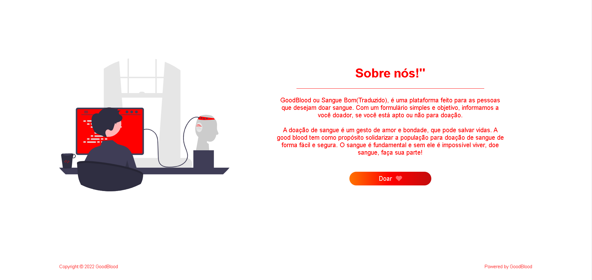
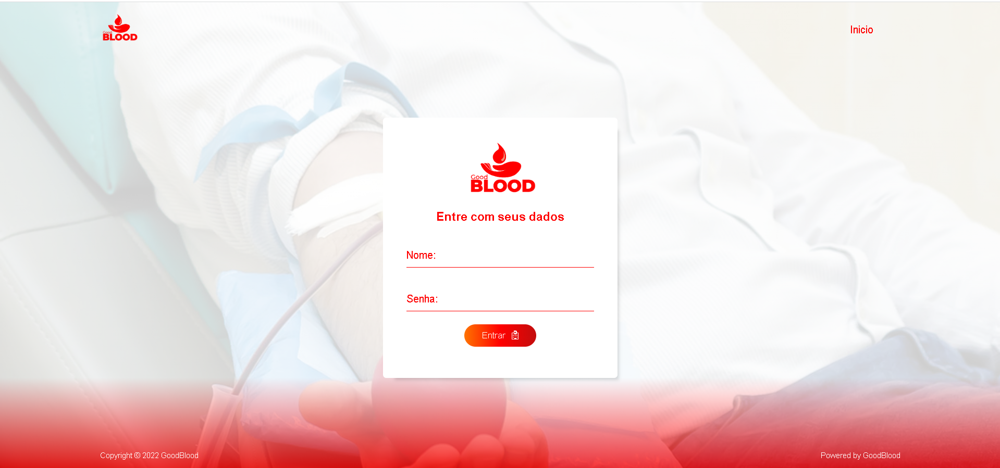
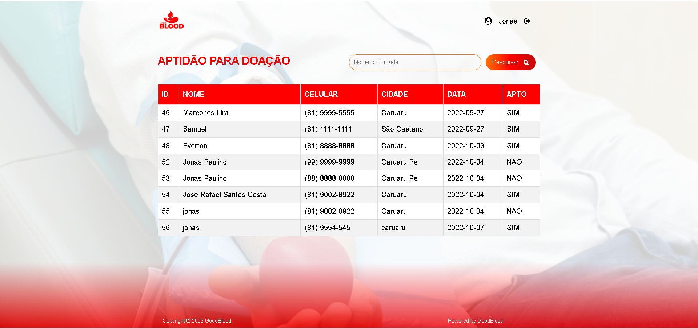
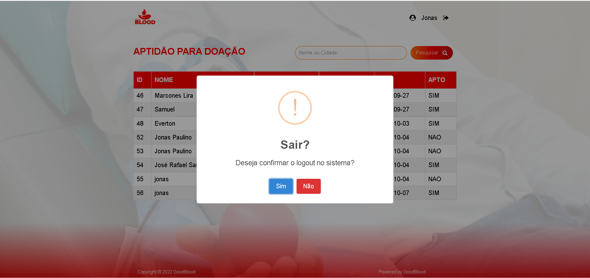

👋 Olá tudo bem? Sou Jonas Paulino, o professor solicitou um website com algumas funções em php.

✅ Pagina incial apresentação  
✅ Pagina de login  
✅ Pagina de doar  
✅ Pagina de gestão  

<h1>Algumas imagens do projeto</h1>
<h3>Tela inicial</h3>
  
<h3>Tela Sobre</h3>
  
<h3>Tela login</h3>
  
<h3>Tela gestão</h3>
  
<h3>TMenssageiro</h3>
  